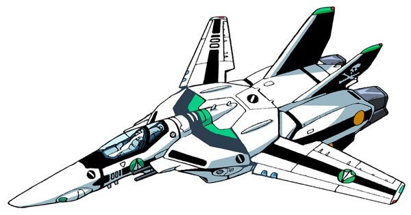

# Air Force Headquarters

공군본부 Vue.js 프레임워크 학습 저장소 입니다.

 

### 실습

단계 별 학습 자료를 실습하려면 적절한 브랜치(Branch)를 선택해 자료를 다운로드 받아야 합니다. 
예를 들어 7단계 학습 자료는 `lesson-7` 브랜치를 선택합니다.

 

### 가이드북

수업에서 참고할 Vue.js 학습 가이드 북입니다.

- [Vue.js 러닝 가이드](https://yamoo9.github.io/vue/)

 

### 실습 자료

수업 진행 내용 학습자료 입니다.

자료 | 설명
--- | ---
[lesson01.zip](https://github.com/yamoo9/Air-Force-Headquarters/archive/lesson01.zip) | Vue CLI 3를 사용한 프로제트 생성 및 스캐폴딩
[lesson02.zip](https://github.com/yamoo9/Air-Force-Headquarters/archive/lesson02.zip) | 이디야(Ediya) UI 예제 → Vue.js 프레임워크 적용
[lesson03.zip](https://github.com/yamoo9/Air-Force-Headquarters/archive/lesson03.zip) | 이디야(Ediya) UI 헤더 영역 → 선언적 렌더링, 속성 바인딩
[lesson04.zip](https://github.com/yamoo9/Air-Force-Headquarters/archive/lesson04.zip) | 이디야(Ediya) UI 헤더 영역 → 조건부 렌더링, 리스트 렌더링
[lesson05.zip](https://github.com/yamoo9/Air-Force-Headquarters/archive/lesson05.zip) | 이디야(Ediya) UI 헤더 영역 → 이벤트 바인딩
[lesson06.zip](https://github.com/yamoo9/Air-Force-Headquarters/archive/lesson06.zip) | 이디야(Ediya) UI 헤더 영역 → 메서드와 계산된 속성
[lesson07.zip](https://github.com/yamoo9/Air-Force-Headquarters/archive/lesson07.zip) | 이디야(Ediya) UI 헤더 영역 → 컴포넌트
[lesson08.zip](https://github.com/yamoo9/Air-Force-Headquarters/archive/lesson08.zip) | 이디야(Ediya) UI 헤더 영역 → 슬롯
[lesson09.zip](https://github.com/yamoo9/Air-Force-Headquarters/archive/lesson09.zip) | 이디야(Ediya) UI 헤더 영역 → 글로벌 컴포넌트
[lesson10.zip](https://github.com/yamoo9/Air-Force-Headquarters/archive/lesson10.zip) | 이디야(Ediya) UI 헤더 영역 → 컴포넌트 통신: 속성 전달, 커스텀 이벤트
[lesson11.zip](https://github.com/yamoo9/Air-Force-Headquarters/archive/lesson11.zip) | 이디야(Ediya) UI 메인 영역 → 종합(렌더링, 바인딩, 컴포넌트, 슬롯, 통신) 적용