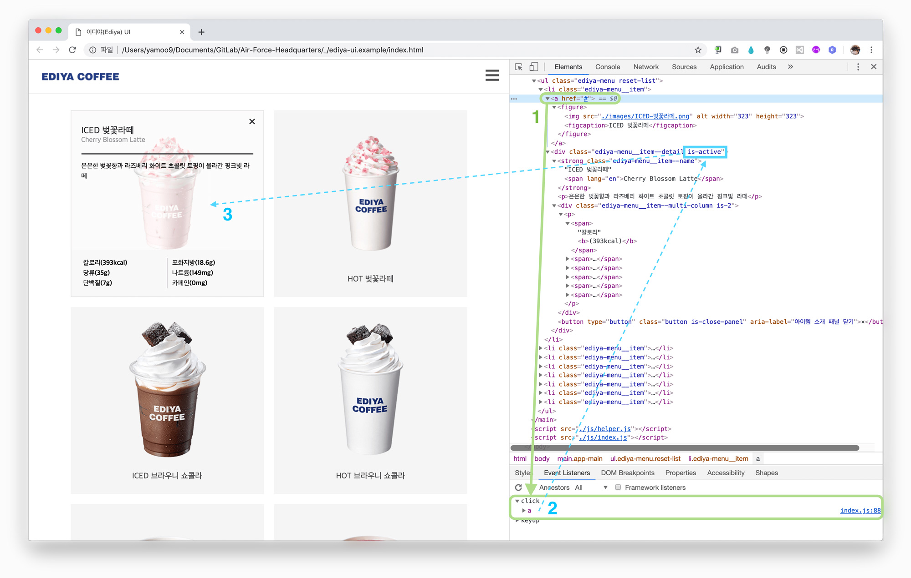
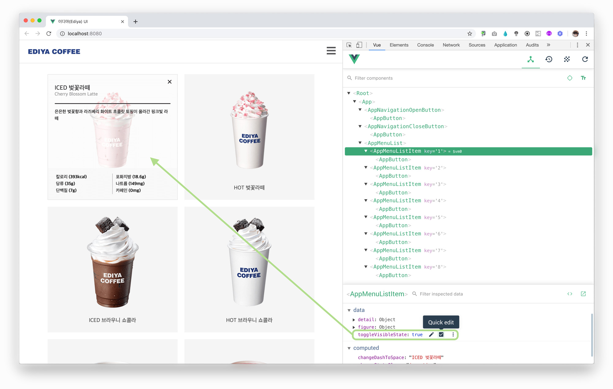

# Air Force Headquarters

공군본부 Vue.js 프레임워크 학습 저장소 입니다. 수업은 [Vue.js 러닝 가이드](https://yamoo9.github.io/vue/)를 통해 진행됩니다.

 

### 비교

순수 웹 기술인 HTML, CSS, JavaScript, DOM API를 활용해 제작된 결과물

Vue.js 프레임워크를 활용해 제작된 결과물

 

### 실습

단계 별 학습 자료를 실습하려면 적절한 브랜치(Branch)를 선택해 자료를 다운로드 받거나, 코드를 참고할 수 있습니다. 
예를 들어 7단계 학습 자료는 `lesson-7` 브랜치를 선택합니다.

 

### 실습 자료

#### 1. Vue.js 라이브러리 (with vue.js)

Vue.js 라이브러리 학습 진행을 위한 자료 입니다.

자료 | 설명
--- | ---
[APRVD.7z](https://github.com/yamoo9/Air-Force-Headquarters/raw/master/_/APRVD.7z) | APRVD UI: Vue.js 라이브러리 활용
[BandiZip](https://drive.google.com/open?id=1NzP_96VPxBudyhCtT7BXnnyJtp5wKCiG) | 7z, zip 압축/해제 도구 ([website](https://kr.bandisoft.com/bandizip/))

#### 2. Vue.js 프레임워크 (with Vue CLI 3, Axios)

Vue.js 프레임워크 학습 진행을 위한 자료 입니다.

자료 | 설명
--- | ---
[ediya-ui.example.7z](https://github.com/yamoo9/Air-Force-Headquarters/raw/master/_/ediya-ui.example.7z) | 이디야(Ediya) UI: UI JavaScript(ES5) 코드 → ECMAScript(ES6+) 코드로 변경
[lesson01.zip](https://github.com/yamoo9/Air-Force-Headquarters/archive/lesson01.zip) | Vue CLI 3를 사용한 프로제트 생성 및 스캐폴딩
[lesson02.zip](https://github.com/yamoo9/Air-Force-Headquarters/archive/lesson02.zip) | 이디야(Ediya) UI 예제 → Vue.js 프레임워크 적용
[lesson03.zip](https://github.com/yamoo9/Air-Force-Headquarters/archive/lesson03.zip) | 이디야(Ediya) UI 헤더 영역 → 선언적 렌더링, 속성 바인딩
[lesson04.zip](https://github.com/yamoo9/Air-Force-Headquarters/archive/lesson04.zip) | 이디야(Ediya) UI 헤더 영역 → 조건부 렌더링, 리스트 렌더링
[lesson05.zip](https://github.com/yamoo9/Air-Force-Headquarters/archive/lesson05.zip) | 이디야(Ediya) UI 헤더 영역 → 이벤트 바인딩
[lesson06.zip](https://github.com/yamoo9/Air-Force-Headquarters/archive/lesson06.zip) | 이디야(Ediya) UI 헤더 영역 → 메서드와 계산된 속성
[lesson07.zip](https://github.com/yamoo9/Air-Force-Headquarters/archive/lesson07.zip) | 이디야(Ediya) UI 헤더 영역 → 컴포넌트
[lesson08.zip](https://github.com/yamoo9/Air-Force-Headquarters/archive/lesson08.zip) | 이디야(Ediya) UI 헤더 영역 → 슬롯
[lesson09.zip](https://github.com/yamoo9/Air-Force-Headquarters/archive/lesson09.zip) | 이디야(Ediya) UI 헤더 영역 → 글로벌 컴포넌트
[lesson10.zip](https://github.com/yamoo9/Air-Force-Headquarters/archive/lesson10.zip) | 이디야(Ediya) UI 헤더 영역 → 컴포넌트 통신: 속성 전달, 커스텀 이벤트
[lesson11.zip](https://github.com/yamoo9/Air-Force-Headquarters/archive/lesson11.zip) | 이디야(Ediya) UI 메인 영역 → 종합(렌더링, 바인딩, 컴포넌트, 슬롯, 통신) 적용
[lesson12.zip](https://github.com/yamoo9/Air-Force-Headquarters/archive/lesson12.zip) | 이디야(Ediya) UI 헤더 영역 → 앱 헤더 컴포넌트로 분리
[lesson13.zip](https://github.com/yamoo9/Air-Force-Headquarters/archive/lesson13.zip) | 이디야(Ediya) UI → API 비동기 처리 (with Axios)
[lesson14.zip](https://github.com/yamoo9/Air-Force-Headquarters/archive/lesson14.zip) | 이디야(Ediya) UI → API 서비스(Service) 모듈
[lesson15.zip](https://github.com/yamoo9/Air-Force-Headquarters/archive/lesson15.zip) | 이디야(Ediya) UI → async/await 활용
[lesson16.zip](https://github.com/yamoo9/Air-Force-Headquarters/archive/lesson16.zip) | 이디야(Ediya) UI → 배포(build : [※ 참고](https://github.com/vuejs/vue-cli/issues/3678))
[lesson17.zip](https://github.com/yamoo9/Air-Force-Headquarters/archive/lesson17.zip) | 이디야(Ediya) UI 튜토리얼 완료

#### 3. Vuex 라이브러리

Vuex 라이브러리 학습 진행을 위한 자료 입니다.

자료 | 설명
--- | ---
[lesson17.zip](https://github.com/yamoo9/Air-Force-Headquarters/archive/lesson17.zip) | 이디야(Ediya) UI → Vuex 스토어 설치/구성
[lesson18.zip](https://github.com/yamoo9/Air-Force-Headquarters/archive/lesson18.zip) | 이디야(Ediya) UI → Vuex 맵 헬퍼 활용
[lesson19.zip](https://github.com/yamoo9/Air-Force-Headquarters/archive/lesson19.zip) | 이디야(Ediya) UI → Vuex 모듈 활용
[lesson20.zip](https://github.com/yamoo9/Air-Force-Headquarters/archive/lesson20.zip) | 이디야(Ediya) UI → Vuex 모듈 네임스페이스 활용
[lesson21.zip](https://github.com/yamoo9/Air-Force-Headquarters/archive/lesson21.zip) | 이디야(Ediya) UI Vuex 튜토리얼 완료

#### 4. Vue Router 라이브러리

Vue Router 라이브러리 학습 진행을 위한 자료 입니다.

자료 | 설명
--- | ---
[lesson21.zip](https://github.com/yamoo9/Air-Force-Headquarters/archive/lesson21.zip) | 이디야(Ediya) UI → Vue Router 설치 및 구성
[lesson22.zip](https://github.com/yamoo9/Air-Force-Headquarters/archive/lesson22.zip) | 이디야(Ediya) UI → 라우터 링크 설정
[lesson23.zip](https://github.com/yamoo9/Air-Force-Headquarters/archive/lesson23.zip) | 이디야(Ediya) UI → 다이내믹 라우트 페이지 설정
[lesson24.zip](https://github.com/yamoo9/Air-Force-Headquarters/archive/lesson24.zip) | 이디야(Ediya) UI → 오프 캔버스 메뉴 키보드 접근성 향상
[lesson25.zip](https://github.com/yamoo9/Air-Force-Headquarters/archive/lesson25.zip) | 이디야(Ediya) UI Vue Router 튜토리얼 완료